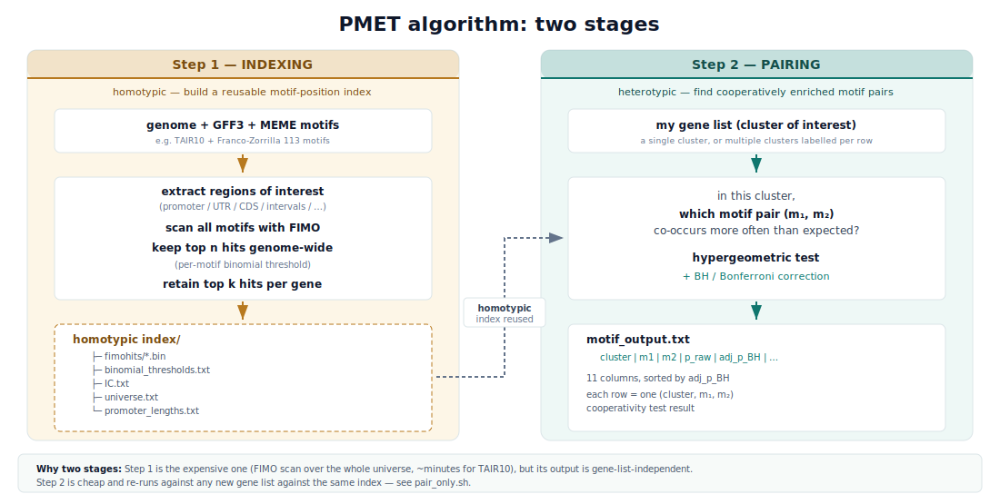
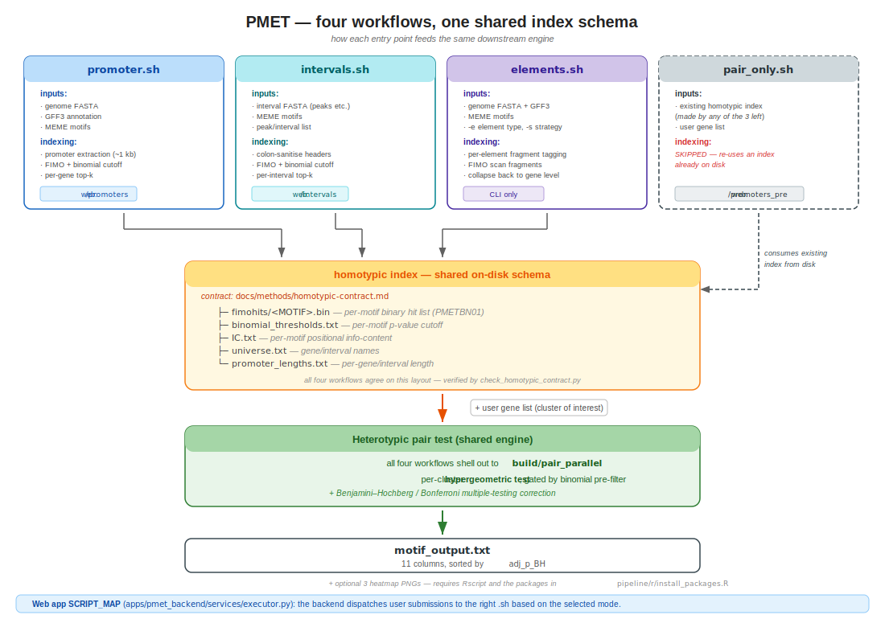
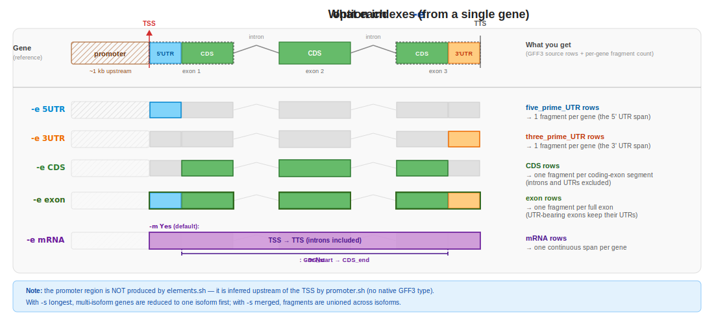
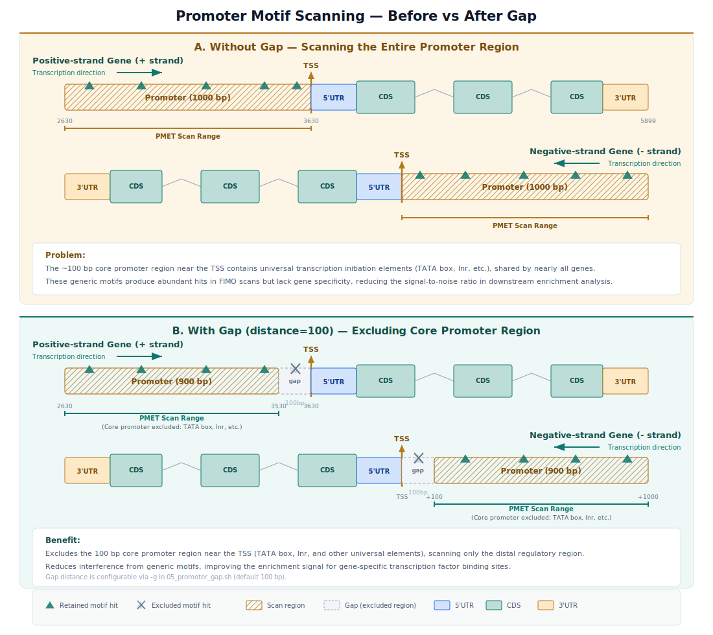
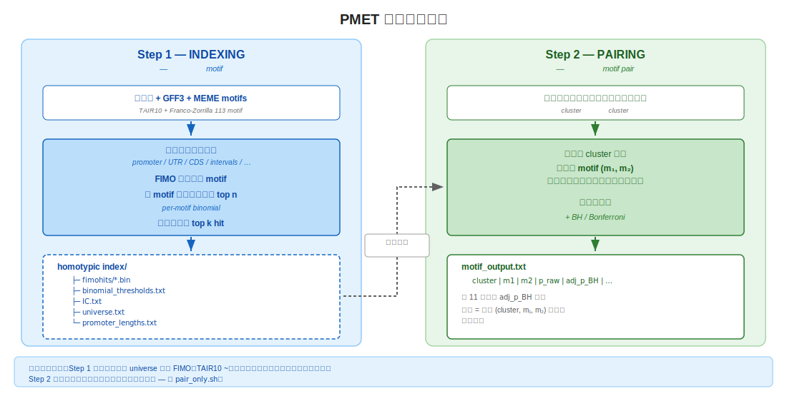
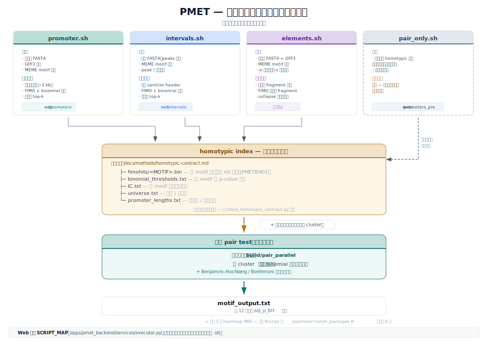
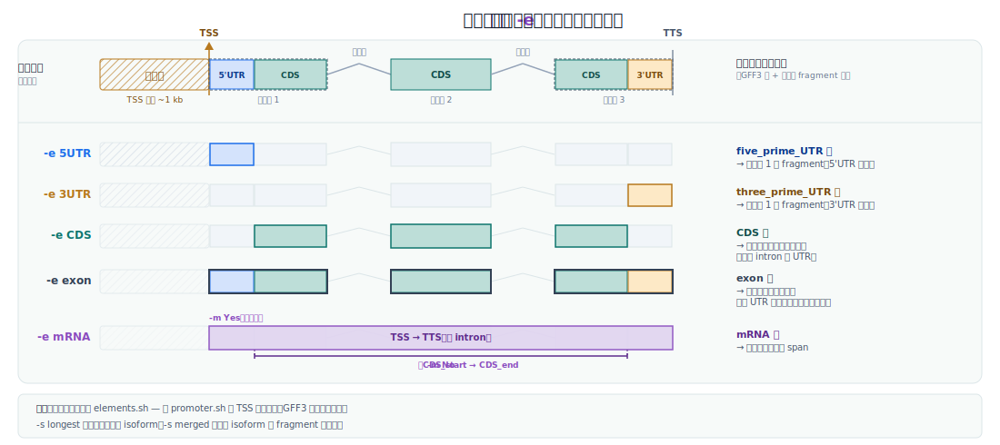
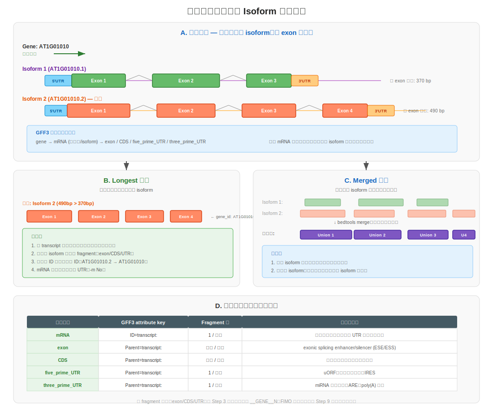
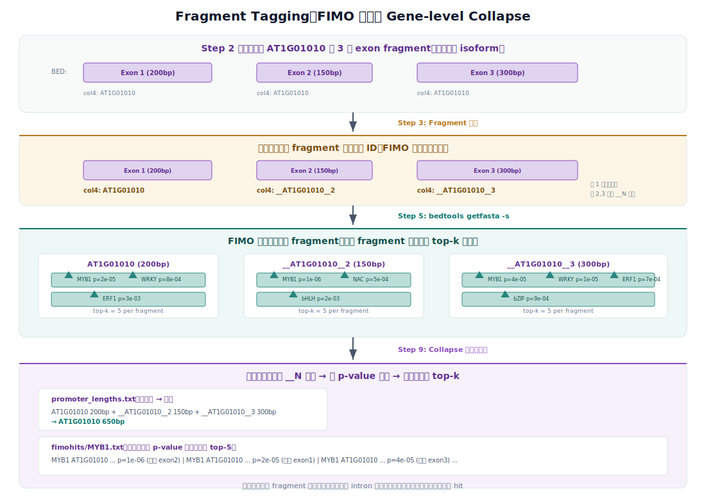
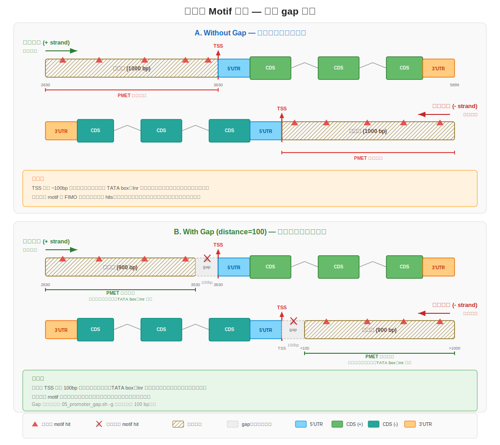

# PMET — Paired Motif Enrichment Tool

**[English](#en) · [汉文](#cn)**

---

<a id="en"></a>

## Contents

|                                       |                                  |                                                  |
| ------------------------------------- | -------------------------------- | ------------------------------------------------ |
| [1. What this tool does](#en-1)       | [5. Key parameters](#en-5)       | [9. Web app deployment](#en-9)                   |
| [2. Install & quick start](#en-2)     | [6. Output format](#en-6)        | [10. Tests & regression baseline](#en-10)        |
| [3. The algorithm: two stages](#en-3) | [7. Repository layout](#en-7)    | [11. Troubleshooting — first-time gotchas](#en-11) |
| [4. The four workflows](#en-4)        | [8. Documentation map](#en-8)    | [12. Migration history](#en-12)                  |
|                                       |                                  | [→ 跳到汉文](#cn)                                |

<a id="en-1"></a>

## 1. What this tool does

PMET answers one question:

> Across a gene set you care about, which transcription factor (TF) motifs **co-occur in pairs** in their promoters (or any other region you specify) more often than chance?

Co-occurrence suggests two TFs may physically cooperate to regulate the same gene set — most TFs do not bind DNA alone; they need a partner adjacent on the sequence to drive a regulatory output. PMET finds those pairs.

**Two ways to use it.** As a CLI: invoke one of the four workflow scripts under [`scripts/workflows/`](scripts/workflows/) directly (see [§4](#en-4)). As a web app: a docker stack (FastAPI + Celery + Next.js + redis + nginx) that takes user submissions through the same workflow scripts. The user-facing flow is

> browser submits → API drops a job on redis → worker pulls it, runs the workflow under [`scripts/workflows/`](scripts/workflows/), writes outputs to `results/app/<task_id>/` → email goes out with a download link

— see [§9](#en-9) for the deployment.

> **New to motif analysis?** [`docs/glossary.md`](docs/glossary.md) has one-paragraph definitions for the domain words this README throws around (motif vs hit, homotypic vs heterotypic, IC threshold, raw p vs adj_p_BH, …).

<a id="en-2"></a>

## 2. Install & quick start

The fastest way to convince yourself PMET works on your machine — and to see what its output actually looks like — is to run the bundled demo. **Three commands, ~30 seconds end-to-end.** No real data needed; the demo inputs ship in the repo.

```bash
# 1. Compile the C/C++ engines into ./build/  (~30 s, one-time setup).
make build

# 2. Run indexing + pairing on the bundled demo data under data/demos/  (~5 s).
make demo

# 3. Look at the actual answer — one row per (cluster, motif pair).
#    See §6 for what each column means.
head results/cli/demo/pairing/motif_output.txt
```

You should see a TAB-separated table with one row per `(cluster, motif pair)`. [§6](#en-6) walks through what each column means and what counts as a "significant" pair; [§4](#en-4) covers the four workflows you'll reach for once you graduate to real data.

### Run a workflow on your own data

`make demo` is just a shortcut. The four CLI entry points live under [`scripts/workflows/`](scripts/workflows/) — one per analysis style (see [§4](#en-4) for which to pick). Each takes the same kind of inputs and accepts `-h` for the full option list.

Minimal real-data invocation, using `promoter.sh` (the canonical case):

```bash
# See every option this workflow accepts
bash scripts/workflows/promoter.sh -h

# Run on your own genome / annotation / motif library / gene clusters,
# writing all outputs under results/cli/myrun/ instead of the default.
bash scripts/workflows/promoter.sh \
    -s my_genome.fa \
    -a my_annot.gff3 \
    -m my_motifs.meme \
    -g my_clusters.txt \
    -o results/cli/myrun/01_homotypic \
    -x results/cli/myrun/02_heterotypic

# Or — same call wired to the real inputs already in this repo
# (TAIR10 reference + Franco-Zorrilla 2014 motif library + a real heat-stress gene cluster). Copy-paste runnable as-is.
bash scripts/workflows/promoter.sh \
    -s data/reference/TAIR10.fasta \
    -a data/reference/TAIR10.gff3 \
    -m data/motifs/Franco-Zorrilla_et_al_2014.meme \
    -g data/genes/heat_top300.txt \
    -o results/cli/heat_top300/01_homotypic \
    -x results/cli/heat_top300/02_heterotypic
```

`-g` is a TSV of `<cluster_label> <gene_id>` per line; the other three are standard FASTA / GFF3 / MEME files. Outputs land under `results/cli/<workflow>/` by default; [§6](#en-6) explains how to read `motif_output.txt`.

### What you need installed

System tools the workflows assume on `$PATH`. `00_env_check.sh` sanity-checks the same list:

| Tool | Min version | Used by | Notes |
|---|---|---|---|
| `cmake` | 3.10 | `make build` | configures the C/C++ engines |
| C/C++ compiler | C99 + C++17 | `make build` | gcc 7+ or clang 6+ |
| `bedtools` | 2.30+ recommended | promoter / intervals / elements | needs `-s` strand support (any modern build has it) |
| `samtools` | 1.10+ | promoter / elements | for `faidx` |
| GNU `parallel` | any | promoter / elements | per-cluster fan-out |
| MEME suite (`fasta-get-markov`, `fimo`) | 5.0+ | indexing | scans motifs against sequence |
| `python3` | 3.8+ | helper scripts + backend | backend deps in `apps/pmet_backend/requirements.txt` |
| `R` + `Rscript` | 4.0+ | heatmap stage only | packages: see [`scripts/r/install_packages.R`](scripts/r/install_packages.R). Without R the `motif_output.txt` is still produced; only the heatmap step is skipped. |

For the web stack ([§9](#en-9)) you also need:

| Tool | Min version |
|---|---|
| `docker` | 20.10+ |
| `docker compose` | v2.x (the `docker compose` plugin, not standalone `docker-compose`) |
| `node` + `npm` | 18.17+ (Next.js 14 requirement) — only if you iterate on the frontend outside docker |

Wall-clock expectations for canonical inputs (full table at [`docs/perf/runtime_reference.md`](docs/perf/runtime_reference.md)): demo ~5 s, `make test` (core + unit + integration) ~10 s, `make baseline` ~30 s, `make test-audit` ~7 min, a TAIR10 promoter scan with CIS-BP2 on 16 cores ~30 min.

### Real-data prerequisites

Anything beyond the bundled demo needs public datasets. Two tiers, fetch what you need:

```bash
# Tier 1 — TAIR10 reference only (~250 MB), needed by promoter.sh / elements.sh:
bash scripts/workflows/cli/00_env_check.sh    # also checks tool versions on your $PATH

# Tier 2 — TAIR10 + 21-species pre-computed indexes (~16 GB, run ONCE):
make fetch-data                                # needed by pair_only.sh against canonical
                                               # species and by the web app's
                                               # promoters_pre mode
```

The R heatmap stage needs `Rscript` plus the packages listed in [`scripts/r/install_packages.R`](scripts/r/install_packages.R); without R the `motif_output.txt` is still produced — only the heatmap step is skipped.

### Save yourself an hour

If you're new, [§11 Troubleshooting](#en-11) lists the six things that trip up most first-time users (chromosome-name mismatches between GFF3 and FASTA, FIMO vs `:` in headers, gene-list format, missing R packages, port conflicts, stuck "running" tasks). Skim it before running on your own data.

<a id="en-3"></a>

## 3. The algorithm: two stages



**Step 1 — Indexing (homotypic)**: scan every motif in the MEME file across your chosen region (promoter / UTR / CDS / ...) using FIMO. For each motif, a binomial threshold keeps the top n hits genome-wide; per-gene we keep at most k best hits. The result is an **index** that can be reused.

**Step 2 — Pairing (heterotypic)**: read the step-1 index, run a pair-enrichment test on your gene list. For every motif pair (m₁, m₂), is their co-occurrence in your cluster significantly higher than the genome-wide background? The test is a **hypergeometric**, with raw and BH/Bonferroni-adjusted p-values.

<a id="en-4"></a>

## 4. The four workflows

The four main scripts live under [`scripts/workflows/`](scripts/workflows/). Three of them produce a homotypic index, the fourth (`pair_only.sh`) re-uses one. Each has a corresponding audit + reference doc under [`docs/workflows/`](docs/workflows/) (step-by-step, biological intent, regression SHA anchors).



### 4.1 Promoters — `promoter.sh` &nbsp;[details](docs/workflows/promoter.md)

The classic case. Scan ~1 kb upstream of every TSS (with 5'UTR included by default).

```bash
# Default run — uses the bundled TAIR10 reference + Franco-Zorrilla motif library.
bash scripts/workflows/promoter.sh

# Or point at any other species' genome + annotation.
bash scripts/workflows/promoter.sh -s my_genome.fa -a my_annot.gff3
```

### 4.2 Arbitrary intervals — `intervals.sh` &nbsp;[details](docs/workflows/intervals.md)

Use this when your unit of analysis is not "the promoter of a gene" but ATAC/ChIP peaks, conserved elements, or any other FASTA region. Each FASTA record name (e.g. `chr1:1234-5678`) is one analysis unit; the script auto-sanitises `:` in headers (FIMO and the binary fimohits format don't accept it).

```bash
bash scripts/workflows/intervals.sh \
    -s data/demos/intervals/indexing/intervals.fa \
    -m data/demos/intervals/indexing/motif.meme \
    -g data/demos/intervals/indexing/peaks.txt
```

### 4.3 Genomic elements — `elements.sh` &nbsp;[details](docs/workflows/elements.md)

Not restricted to promoters. Index any GFF3 feature type: 5'UTR / 3'UTR / CDS / mRNA / exon. The figure below shows one gene on the chromosome (top row), then five rows below — one per `-e` option — with the indexed parts highlighted:



The `mRNA` feature in GFF3 is the **primary transcript** — the full span from TSS to TTS, introns included. This is distinct from "mature mRNA" (exons only, after splicing) which GFF3 does not encode directly.

| GFF3 type         | Physical region indexed                                | In plain words                                    |
| ----------------- | ------------------------------------------------------ | ------------------------------------------------- |
| `mRNA`            | TSS → TTS as one continuous span, **introns included** | the whole gene body — TFs can bind in introns too |
| `CDS`             | one interval per coding exon, **introns excluded**     | only the protein-coding bits                      |
| `exon`            | one interval per exon (UTR + CDS portions)             | like CDS but also catches UTR-bearing exons       |
| `five_prime_UTR`  | the 5' UTR span per isoform                            | untranslated leader upstream of CDS               |
| `three_prime_UTR` | the 3' UTR span per isoform                            | untranslated trailer downstream of CDS            |

A gene may have multiple isoforms — two aggregation strategies:

| `-s`      | Meaning                                                                         |
| --------- | ------------------------------------------------------------------------------- |
| `longest` | per gene, pick the isoform with the largest total length for the chosen element |
| `merged`  | take the genomic union across all isoforms as one span                          |

For `-e mRNA` an additional `-m Yes\|No` controls UTR inclusion:

| Command              | Resulting region                                                  |
| -------------------- | ----------------------------------------------------------------- |
| `-e mRNA -m Yes`     | full mRNA (5'UTR + CDS + 3'UTR), one span per gene                |
| `-e mRNA -m No`      | mRNA minus UTRs (CDS span), one span per gene                     |
| `-e CDS` / `-e exon` | each CDS fragment / exon as its own span (no isoform aggregation) |

`-m` is only meaningful with `-s longest -e mRNA`; in any other combination it is ignored with a warning.

```bash
# Index the 5'UTRs of each gene's longest isoform (8 threads).
bash scripts/workflows/elements.sh -s longest -e 5UTR -t 8

# Same but for the full mRNA span (UTRs + CDS, one interval per gene).
bash scripts/workflows/elements.sh -s longest -e mRNA -m Yes -t 8
```

### 4.4 Re-pair an existing index — `pair_only.sh` &nbsp;[details](docs/workflows/pair_only.md)

Skip the expensive indexing stage; against an existing index, swap in a new gene list and rerun pairing only. The web app's `promoters_pre` mode is backed by this same script.

```bash
bash scripts/workflows/pair_only.sh \
    -d results/cli/promoter/01_homotypic \
    -g data/genes/my_new_clusters.txt \
    -o results/cli/repaired
```

<a id="en-5"></a>

## 5. Key parameters

Each script's `-h` is the authoritative reference (with defaults). The table below only highlights the **easy-to-trip-on** ones — short-option letters **differ across scripts**, so memorise per-script.

### Indexing stage

| Parameter                                         | promoter | intervals | elements        |
| ------------------------------------------------- | -------- | --------- | --------------- |
| topn / per-motif top n genome-wide (default 5000) | `-n`     | `-n`      | (fixed)         |
| maxk / per-gene max k hits (default 5)            | `-k`     | `-k`      | (fixed)         |
| FIMO p-value threshold (default 0.05)             | `-f`     | `-f`      | (fixed)         |
| promoter length, bp (default 1000)                | `-p`     | —         | —               |
| include 5'UTR (default Yes)                       | `-u`     | —         | —               |
| promoter overlap (default NoOverlap)              | `-v`     | —         | —               |
| element type                                      | —        | —         | `-e` (required) |
| isoform strategy (`longest`)                      | —        | —         | `-s`            |

`elements.sh` deliberately exposes only `-s -e -m -t -d`; everything else uses `_pmet_index_element.sh` defaults — call that lower-level script directly if you need finer knobs.

### Pairing stage

| Parameter                                                | promoter        | intervals       | elements                        | pair_only       |
| -------------------------------------------------------- | --------------- | --------------- | ------------------------------- | --------------- |
| IC threshold (filters low-information motifs, default 4) | **`-c`**        | **`-c`**        | (fixed)                         | **`-i`**        |
| gene list                                                | `-g` (required) | `-g` (required) | (loops over `data/genes/*.txt`) | `-g` (required) |
| threads (default 4; pair_only check `-h`)                | `-t`            | `-t`            | `-t`                            | `-t`            |

> ⚠️ The IC threshold is `-c` in `promoter.sh / intervals.sh` but `-i` in `pair_only.sh` — historical mismatch, never harmonised. In `promoter.sh`, `-i` is actually `gff3_id_key` (the GFF3 attribute key).

**MinHash prefilter (opt-in).** `pairing_parallel` ships a MinHash-based prefilter (`-m <K>`) that can skip pair candidates with low estimated gene-set intersection. The default is off — calibration on CIS-BP2 (see [docs/perf/minhash_calibration.md](docs/perf/minhash_calibration.md)) did not find a setting that gave meaningful speedup without a non-trivial false-negative rate. Power users on bigger hardware can enable it with `PMET_MINHASH_MIN=N`.

<a id="en-6"></a>

## 6. Output format

The terminal product is `motif_output.txt`, TAB-separated, 11 columns, sorted by `Adjusted p-value (BH)`. Each row answers: in this cluster, is this motif pair co-occurring more than chance?

```
Cluster   Motif 1  Motif 2     #both/cluster  #both/total  cluster_size   raw_p   adj_p (BH)  adj_p (Bonf)  adj_p (Global)  Genes
cortex    AHL12    AHL12_2     3              248          442            0.784   0.784       1.0           1.0             AT1G05680;AT2G20120;AT4G02170;
```

(The real header line uses verbose names like `Number of genes in cluster with both motifs`; the table above abbreviates for fit.)

### How to read one row

Take the `cortex / AHL12 / AHL12_2` row above and translate to plain words:

> The `cortex` cluster has **442** genes. Of those, only **3** had both AHL12 and AHL12_2 hits in their promoter. Across the entire indexed background (every gene with a usable promoter, the universe the workflow scanned), **248** genes had both motifs. The hypergeometric test asks: is `3 / 442` (cortex hit rate) higher than `248 / N` (background hit rate)? Answer: raw p = **0.78**, BH-adjusted p = **0.78** → no — **AHL12 and AHL12_2 are NOT a cooperative pair for `cortex`** in this run.

Treat `Adjusted p-value (BH)` as the call:

- `< 0.05` → significantly cooperative pair, worth following up
- `≈ 1.0` (like 0.78 above) → noise, the pair is no more co-occurring in this cluster than in the background
- between `0.05` and `~0.5` → suggestive but not significant; might be worth re-running with a different IC threshold or a tighter gene list

The `Genes` column lists which cluster genes contribute the co-occurrence — useful when you want to pick concrete biological examples to validate the pair downstream.

<a id="en-7"></a>

## 7. Repository layout

```
core/          C/C++ engines (indexing, pairing) + CMake
scripts/      shared bash + python + R helpers; workflows
apps/
  cli/             command-line entry points and helpers
  pmet_backend/    FastAPI + Celery worker
  pmet_frontend/   Next.js
deploy/        docker-compose, nginx, Dockerfiles
data/          demo / fixture data (large data is gitignored)
tests/
  audit/         workflow audit + auto-rendered docs/workflows/*.md
  baseline/      regression fingerprints
  integration/   end-to-end tests
docs/
legacy/        archived historical code
build/         compile artifacts (gitignored)
results/       run outputs (gitignored): app/ for web tasks, cli/ for pipeline runs
```

Auxiliary scripts under [`scripts/workflows/cli/`](scripts/workflows/cli/): `00_env_check.sh` (dependency check + TAIR10 download), `01_perf_cpu.sh` / `02_perf_params.sh` (perf benchmarks), `05_promoter_gap.sh` (promoter gap analysis — see figure below), `_pmet_index_element.sh` (the indexing sub-pipeline library sourced by `elements.sh` — not invoked directly).

`05_promoter_gap.sh` lets you exclude a window adjacent to the TSS from motif scanning, so that ubiquitous core-promoter elements (TATA box, Inr) don't drown out the signal from cell-type-specific TF sites further upstream:



<a id="en-8"></a>

## 8. Documentation map

Anything too detailed for this README lives under [`docs/`](docs/). One-line tour:

- [`docs/glossary.md`](docs/glossary.md) — domain terms (motif vs hit, IC threshold, raw p vs adj_p_BH, …) for first-time readers.
- [`docs/methods/`](docs/methods/) — algorithm depth: what PMET actually computes ([`pmet.md`](docs/methods/pmet.md)), how promoters are derived from a genome + GFF3 ([`promoter-extraction.md`](docs/methods/promoter-extraction.md)), the on-disk schema indexing must produce ([`homotypic-contract.md`](docs/methods/homotypic-contract.md)), and naming rules ([`naming-conventions.md`](docs/methods/naming-conventions.md)).
- [`docs/workflows/`](docs/workflows/) — per-workflow audit docs, one for each of the four workflows in [§4](#en-4). Auto-regenerated from real runs by `make test-audit`; the OVERALL PASS / WARN / FAIL line at the bottom is the source of truth for "does this workflow's documented behavior still match its code?"
- [`docs/perf/`](docs/perf/) — performance investigations: why MinHash ships off ([`minhash_calibration.md`](docs/perf/minhash_calibration.md)) and wall-clock for canonical inputs ([`runtime_reference.md`](docs/perf/runtime_reference.md)).
- [`docs/deployment.md`](docs/deployment.md) — deep-dive web stack ops (SSL, scaling, backup, operational troubleshooting); companion to [§9](#en-9) below.
- [`docs/archive/`](docs/archive/) — pre-monorepo material kept for historical reference (verification log, the old 03..07 audit docs, etc.).

[`docs/README.md`](docs/README.md) is the topic-to-document index — start there if you came with a specific question.

<a id="en-9"></a>

## 9. Web app deployment

A docker-composed stack (FastAPI + Celery + Next.js + nginx + redis + a stuck-task watchdog) that wraps the same workflow scripts §4 covers. End-users hit it through a browser; submissions land on the worker via redis and outputs go back as a download link in an email.

### 9.1 Before you start

You need on the host (only `docker` is hard-required to bring the stack up; the rest unlocks specific features):

| Need | Why | How |
|---|---|---|
| `docker` 20.10+ and the `docker compose` plugin | every service runs in a container | `docker --version` |
| Free TCP port `5960` on the host | nginx publishes here; the only port `make up` exposes outwards | `lsof -nP -iTCP:5960 -sTCP:LISTEN` should return nothing |
| `data/reference/TAIR10.{fasta,gff3}` (~250 MB) | needed by the `promoters` workflow | `make fetch-data` (also pulls Tier 2; see [§2](#en-2)) |
| `data/precomputed_indexes/<species>/...` (~16 GB) | needed by the `promoters_pre` mode | `make fetch-data` (run **once**) |
| `data/configure/email_credential.txt` | so users get a result-link email when their task finishes; without it task completion still works, just no notification | 5 lines: `username` / `password` (Gmail app-password recommended) / `from_address` / `smtp_server` / `port`. Gitignored — **never commit it**. |
| `data/configure/admin_token.txt` | only needed if you want admin features (see-all-tasks + terminate); without it `/admin/*` returns `503` | `openssl rand -hex 32 > data/configure/admin_token.txt`. Gitignored — **never commit it**. |
| `data/configure/public_base_url.txt` | needed for emails to contain a clickable link back to your deployment; without it the task still completes and the in-browser flow still works, only the email loses its button | one line, **bare domain only**: `https://pmet.example.org` (no path). The backend appends `/tasks/<id>` and `/api/...` itself. Static-file path of the result zip is owned by the docker nginx, not by this file — for `localhost` you can leave this empty and use the in-browser path in [§9.3](#en-9). |

### 9.2 Bring it up

All commands from repo root:

```bash
# Build images + start the stack  (5–10 min on first build, seconds afterwards).
make up

# Show container status — should list 6 services, all up + healthy.
make ps

# Tail logs from all services (Ctrl-C to detach).
make logs

# Stop the stack.
make down

# Rebuild images and restart after editing app code.
make rebuild
```

`make up` is safe to re-run; if a previous container is still publishing :5960 the Makefile auto-stops it.

### 9.3 Use it

- **Open** **http://localhost:5960** in a browser. nginx fronts the frontend at `/` and the API at `/api/...` from the same origin — it ships as a container in the docker stack ([§9.4](#en-9)), no host-side nginx install needed.
- **Submit a task**: pick one of the four entry-point cards on the home page (matches the four workflows in [§4](#en-4)), fill the form, hit submit.
- **Get the result zip** — two paths, either works:
  - **Download** button on the task detail page at `http://localhost:5960/tasks/<task_id>` (always works, no email setup needed);
  - email notification with a link back to that same detail page (only sent if `email_credential.txt` was configured per §9.1; the link's domain comes from `public_base_url.txt`, also §9.1).
- **Look up your tasks**: `/tasks?email=you@example.com` (also reachable from the home page nav). Click any row to open the detail page with the Download button.
- **Admin** (if `admin_token.txt` exists): open [http://localhost:5960/admin/login](http://localhost:5960/admin/login), paste the token. After login you can see all tasks, filter by status / mode / date, terminate in-flight ones, and toggle the per-task "new submission" notification email at `/admin/settings`. The cookie lasts 30 days; rotate by overwriting `admin_token.txt`.

### 9.4 What runs where

| Service | Role | Port |
|---|---|---|
| `nginx` | reverse proxy in front of frontend + api | **5960** (host-published) |
| `frontend` | Next.js UI | 3000 (internal only) |
| `api` | FastAPI HTTP layer | 8000 (internal only) |
| `worker` | Celery worker — runs workflow scripts | — |
| `liveness-watchdog` | kills tasks idle > 15 min (no `progress.json` update) | — |
| `redis` | Celery broker + result backend | 6379 (internal only) |

Only `5960` is exposed to the host; the others are reachable only inside the docker network. Change the host port in [`deploy/docker-compose.yml`](deploy/docker-compose.yml) if you need 5960 free.

### 9.5 Editing app code (bind mounts vs rebuild)

Backend (`apps/pmet_backend/`) and `scripts/` / `data/` / `results/app/` are bind-mounted into the api + worker containers, so host edits take effect without rebuilding the image:

- API code: uvicorn auto-reloads on save.
- Worker code: needs `cd deploy && make restart-worker` to pick up the change (Celery doesn't auto-reload).
- nginx config: `cd deploy && make restart-nginx`.

The **frontend** image is baked at build time (no bind mount). Edits under `apps/pmet_frontend/` require `cd deploy && make rebuild-frontend` (or full `make rebuild`).

The `results/app/` mount is the single canonical location for web-app task outputs — same host path whether the backend runs in docker or locally.

### 9.6 Admin mode in detail

Single-admin auth: one shared token grants "see-all-tasks" and task-level termination. Regular users only see their own tasks (filtered server-side by email). Admins see everything, can filter by status / mode / date, and can kill in-flight runs.

- **All tasks visible** — `/tasks` lists every task on the server, not just the searched email's. The search box still works as a quick filter (substring match on email or task ID).
- **Filters** — additional dropdowns appear: status (pending / running / completed / failed / cancelled), mode (promoters / promoters_pre / intervals), date range. All client-side over the latest 200 tasks.
- **Terminate button** — pending or running tasks get a red `Terminate` button. Click → optional reason prompt → backend marks the task `cancelled`, walks the worker's process tree with `psutil` (SIGTERM, then SIGKILL after 5 s), and emails the user.
- **Settings page** — `/admin/settings` toggles `notify_on_submit`. When off, the worker stops sending the per-task "New Task Submitted" email to the admin. User-facing emails (started / completed / cancelled) are unaffected. Toggle persists in `data/configure/admin_settings.json` and is hot-reloaded.

The `Sign out` button on the settings page deletes the cookie. To rotate the token, just overwrite `data/configure/admin_token.txt` — `data/configure/` is bind-mounted, so the new value is hot-read on the next admin API call (no rebuild needed); existing cookies stop working immediately.

Finer deploy targets: `cd deploy && make help`.

<a id="en-10"></a>

## 10. Tests & regression baseline

Five tracks, each catching a **different class of regression**. Fastest first; each has a `make` target; **`make test` chains the three fast tracks** (core + unit + integration, ~10 s) as the default pre-commit gate. The two writing tracks (audit, baseline) overwrite committed files and stay opt-in.

| Track | Command | Why it exists & what it covers |
|---|---|---|
| Core math kernels (C/C++) | `make test-core` (or `make test-pairing` / `make test-indexing`) | **Why:** if a refactor breaks the math underneath the engines (BH correction, hypergeometric, MinHash, etc.), this test fails *before* a real workflow can produce silently-wrong p-values. **Covers:** ~96 unit cases on BH correction, hypergeometric coloc, binomial / Poisson CDF, MinHash sketch, motif-overlap geometry, load-balancing partition, indexing-side string utils. Test binary links the same OBJECT library production uses → tests never drift from what ships. **< 5 s combined.** |
| Repo-wide unit tests (Python / R / bash / TS) | `make test-unit` | **Why:** lock in fixes for bugs that would otherwise have to be rediscovered from a real failed task — task-status inference, the partial-result rescue link, mail templates, error-classification (skip useless retries on permanent failures), watchdog staleness, list_tasks pagination, heatmap dimension cap, MinHash workflow resolver, frontend store-action invariants. **Covers:** the named cases above; one test file per fixed bug. tsx test auto-skips if `apps/pmet_frontend/node_modules` absent. **< 5 s.** |
| Pipeline-level integration | `make test-integration` (runs the smoke; see [`tests/integration/README.md`](tests/integration/README.md) for the heavier scripts) | **Why:** workflow scripts depend on cross-script invariants (bedtools called with `-s`, chromosome-name preflight, GFF3-to-BED handles split fragments) that pure unit tests can't catch. **Covers:** bedtools strand-awareness, `build_promoters.py` uses `-s`, chromosome-name preflight on promoter+anno pipelines, `assess_integrity.py` handles non-adjacent fragments, optional real-data TAIR10 strand check. Heavier scripts (`run_pipeline02_one_combo.sh`, `run_pipeline08_ic_sweep.sh`, `verify_baseline.sh`, `run_with_verify.sh`) run end-to-end pipelines on real data — see the integration README for status. **~3 s for the smoke.** |
| Workflow audit ([`tests/audit/`](tests/audit/)) | `make test-audit` (or `python3 tests/audit/generate.py [<name> ...]` to scope to one) | **Why:** the per-workflow docs at [`docs/workflows/*.md`](docs/workflows/) carry concrete numbers (file hashes, row counts, PASS/FAIL). They'd rot the moment anyone touched a script — so they're regenerated by actually running each workflow against canonical inputs and re-rendering. **Covers:** all four workflows end-to-end (pair_only, intervals, promoter, elements), with SHA-256 anchors as regression sentinels and cross-file invariant checks. pair_only ~15 s, intervals ~16 s, promoter ~2 min, elements ~5 min. **Writes to `docs/workflows/`** → opt-in, not in `make test`. |
| CLI baseline ([`tests/baseline/`](tests/baseline/)) | `make baseline` | **Why:** answers "did my edit accidentally change the demo's numerical output?" in 30 s by hashing every file the demo produces and diffing against a committed fingerprint. **Covers:** every output file from `make demo` plus the production binaries themselves. **Writes `tests/baseline/fingerprints.txt`** → opt-in, not in `make test`. |

`apps/pmet_backend/test_api.py` is a separate 5-stage smoke (imports / TaskCreate / StorageService / PMETExecutor / app load). Run on the host with `python apps/pmet_backend/test_api.py`, or inside the backend image with `cd deploy && make test`.

<a id="en-11"></a>

## 11. Troubleshooting — first-time gotchas

The six things that bite new users most often. Each is a real support email reduced to a one-line hint:

| Symptom | What's actually wrong | Fix |
|---|---|---|
| Pipeline aborts with `Chromosome name mismatch (gff3='Chr1', fasta='1')` | TAIR10 ships chromosomes as `1, 2, ...`; many other GFF3s use `Chr1, Chr2, ...`. The two files have to agree. | Rename one side, or pass matching files. The `promoter` / `elements` / `02_perf_params` workflows all have a preflight that catches this *before* they waste an hour on FIMO. |
| `intervals.sh` errors on a header containing `:` (e.g. `chr1:1234-5678`) | FIMO and the binary `fimohits` format don't accept `:` in FASTA record names. | `intervals.sh` auto-sanitises `:` → `_`. If you still hit this, you're calling the lower-level binary directly — go through the workflow script instead. |
| Pairing complains about an empty / wrong gene list | The gene list is **two columns** (`cluster_name<TAB>gene_id`), not one. | See [`data/demos/promoters/pairing/demo`](data/demos/promoters/pairing/demo) for the canonical shape; [`data/genes/genes_cell_type_treatment.txt`](data/genes/genes_cell_type_treatment.txt) is a real-world example. |
| `motif_output.txt` is produced but no heatmap appears | R or one of its packages (`ggplot2`, `RColorBrewer`, `pheatmap`) is missing. | The heatmap stage is best-effort — install with `Rscript scripts/r/install_packages.R` and rerun, or just consume `motif_output.txt` directly and skip the heatmap. |
| `make up` says `port 5960 already in use` | Another container or a non-docker process is bound to 5960. | The Makefile auto-stops leftover docker containers on 5960; if it still fails, the bound process is non-docker — the error message lists the PID. Free it, or change the host port in [`deploy/docker-compose.yml`](deploy/docker-compose.yml). |
| Web task is stuck on "running" forever | The worker was SIGKILLed mid-run and never wrote the final status. | The `liveness-watchdog` container marks any task with no `progress.json` update for 15 min as `failed`. To rescue earlier: `cd deploy && make restart-worker` and resubmit. |

If none of these match, the next places to look are [`tests/integration/run_smoke.sh`](tests/integration/run_smoke.sh) (catches most environment / convention regressions in ~3 s) and the backend logs (`make logs` in repo root, then filter by service).

<a id="en-12"></a>

## 12. Migration history

This repo is the union of three previously-separate directories (`PMET_project`, `pmet_analysis_pipeline`, `pmet_shiny_app`), unified at tag `v0.1.0-monorepo`. See [`tests/baseline/README.md`](tests/baseline/README.md) for the fingerprints used to verify no regressions across the move.

---

<a id="cn"></a>

## 目录

|                                |                          |                                       |
| ------------------------------ | ------------------------ | ------------------------------------- |
| [1. 这个工具做什么](#cn-1)     | [5. 关键参数](#cn-5)     | [9. Web 部署](#cn-9)                  |
| [2. 安装与 Quick start](#cn-2) | [6. 输出格式](#cn-6)     | [10. 测试与回归基线](#cn-10)          |
| [3. 算法：两步走](#cn-3)       | [7. 仓库结构](#cn-7)     | [11. 排错 —— 新人最先撞的几堵墙](#cn-11) |
| [4. 四种工作流](#cn-4)         | [8. 文档导航](#cn-8)     | [12. 迁移历史](#cn-12)                |
|                                |                          | [→ Jump to English](#en)             |

<a id="cn-1"></a>

## 1. 这个工具做什么

PMET 回答一个问题：

> 在一组你感兴趣的基因里，哪些转录因子（TF）**成对地**出现在启动子（或其它指定区域）中，比随机期望更频繁？

成对出现意味着两个 TF 可能在物理上协同调控同一组基因 — 大多数 TF 不单独结合 DNA，需要 partner 挨着绑定才能产生调控输出。PMET 找出这些 TF pair。

**两种用法。** CLI：直接调 [`scripts/workflows/`](scripts/workflows/) 下四个 workflow 脚本之一（见 [§4](#cn-4)）。Web 应用：一个 docker 栈（FastAPI + Celery + Next.js + redis + nginx），通过同一套 workflow 脚本接受用户提交。面向用户的链路是

> 浏览器提交 → API 把任务扔到 redis 队列 → worker 捡起来跑 [`scripts/workflows/`](scripts/workflows/) 下的对应脚本 → 输出写 `results/app/<task_id>/` → 邮件给用户发下载链接

—— 部署细节见 [§9](#cn-9)。

> **第一次接触 motif 分析？** [`docs/glossary.md`](docs/glossary.md) 给本 README 用到的领域词都做了一段定义（motif vs hit、同型 vs 异型、IC 阈值、raw p vs adj_p_BH …）。

<a id="cn-2"></a>

## 2. 安装与 Quick start

最快说服你自己 PMET 在这台机器上能跑、并且亲眼看一眼它的输出长什么样的办法 —— 跑一遍自带 demo。**三条命令，端到端 ~30 秒。** 不需要任何真实数据，demo 输入跟仓库一起走。

```bash
# 1. 编译 C/C++ 引擎到 ./build/（~30 秒，一次性）。
make build

# 2. 跑 data/demos/ 下的 demo 数据：indexing + pairing（~5 秒）。
make demo

# 3. 看真正的答案 —— 每行一对 (cluster, motif pair)。每列怎么读见 §6。
head results/cli/demo/pairing/motif_output.txt
```

应该看到一张 TAB 分隔的表，每行一个 `(cluster, motif 对)`。 [§6](#cn-6) 讲每列什么意思、什么算"显著协同"；[§4](#cn-4) 讲跑真实数据时该挑哪个 workflow。

### 用 CLI 跑自己的数据

`make demo` 只是个捷径。4 个 CLI 入口都在 [`scripts/workflows/`](scripts/workflows/) 下（哪种分析挑哪个见 [§4](#cn-4)），输入形式一致，`-h` 看完整选项。

最小可跑的真实数据调用，以最有代表性的 `promoter.sh` 为例：

```bash
# 看这个 workflow 接受的所有选项
bash scripts/workflows/promoter.sh -h

# 用自己的基因组 / 注释 / motif 库 / gene cluster 跑，
# 输出全部落到 results/cli/myrun/，而不是默认目录。
bash scripts/workflows/promoter.sh \
    -s my_genome.fa \
    -a my_annot.gff3 \
    -m my_motifs.meme \
    -g my_clusters.txt \
    -o results/cli/myrun/01_homotypic \
    -x results/cli/myrun/02_heterotypic

# 或者 —— 同一条命令换成仓库里已有的真实数据
# （TAIR10 参考 + Franco-Zorrilla 2014 motif 库 + 一份真实热胁迫基因 cluster）。拷过去就能直接跑。
bash scripts/workflows/promoter.sh \
    -s data/reference/TAIR10.fasta \
    -a data/reference/TAIR10.gff3 \
    -m data/motifs/Franco-Zorrilla_et_al_2014.meme \
    -g data/genes/heat_top300.txt \
    -o results/cli/heat_top300/01_homotypic \
    -x results/cli/heat_top300/02_heterotypic
```

`-g` 是每行 `<cluster_label> <gene_id>` 的 TSV，其余三项就是标准 FASTA / GFF3 / MEME。输出默认落到 `results/cli/<workflow>/`；`motif_output.txt` 怎么读见 [§6](#cn-6)。

### 需要装的工具

workflow 假定在 `$PATH` 上的系统工具。`00_env_check.sh` 会做同样一份 sanity check：

| 工具 | 最低版本 | 谁用 | 说明 |
|---|---|---|---|
| `cmake` | 3.10 | `make build` | 配置 C/C++ 引擎 |
| C/C++ 编译器 | C99 + C++17 | `make build` | gcc 7+ 或 clang 6+ |
| `bedtools` | 推荐 2.30+ | promoter / intervals / elements | 需要 `-s` strand 支持（任何现代构建都有） |
| `samtools` | 1.10+ | promoter / elements | 用 `faidx` |
| GNU `parallel` | 任意 | promoter / elements | per-cluster fan-out |
| MEME suite（`fasta-get-markov`、`fimo`） | 5.0+ | indexing | motif 对序列扫描 |
| `python3` | 3.8+ | helper 脚本 + 后端 | 后端依赖在 `apps/pmet_backend/requirements.txt` |
| `R` + `Rscript` | 4.0+ | 仅 heatmap 阶段 | 包列表见 [`scripts/r/install_packages.R`](scripts/r/install_packages.R)。缺 R 不影响 `motif_output.txt`，只跳过 heatmap。 |

跑 web 栈（[§9](#cn-9)）还要：

| 工具 | 最低版本 |
|---|---|
| `docker` | 20.10+ |
| `docker compose` | v2.x（`docker compose` 子命令，不是独立的 `docker-compose`） |
| `node` + `npm` | 18.17+（Next.js 14 要求）—— 只在你想脱开 docker 改前端时才用 |

canonical 输入的耗时预期（完整表见 [`docs/perf/runtime_reference.md`](docs/perf/runtime_reference.md)）： demo ~5 秒，`make test`（core + unit + integration）~10 秒， `make baseline` ~30 秒，`make test-audit` ~7 分钟，TAIR10 启动子扫描
+ CIS-BP2 16 核 ~30 分钟。

### 跑真实数据需要什么

非 demo 的任何运行都要拉公共数据集。两档，按需选：

```bash
# Tier 1 —— 只拉 TAIR10 参考（~250 MB），promoter.sh / elements.sh 够用：
bash scripts/workflows/cli/00_env_check.sh    # 顺带检查 $PATH 上的工具版本

# Tier 2 —— TAIR10 + 21 物种预计算索引（~16 GB，跑一次就够）：
make fetch-data                                # pair_only.sh 跑 canonical 物种、
                                               # web app 的 promoters_pre 模式
                                               # 都依赖这个
```

R heatmap 阶段需要 `Rscript` 加 [`scripts/r/install_packages.R`](scripts/r/install_packages.R) 列出的包；缺 R 不影响 `motif_output.txt` 的产出，只跳过 heatmap。

### 帮你省一小时

新人请先扫一眼 [§11 排错](#cn-11)，那里列了新手最容易撞的 6 堵墙（GFF3 与 FASTA 染色体名不一致、FIMO 不认 header 里的 `:`、gene list 格式、缺 R 包、5960 端口被占、任务卡在 running）。跑自己数据之前先看，能救一小时。

<a id="cn-3"></a>

## 3. 算法：两步走



**Step 1 — Indexing（同型搜索）**：在你指定的区域（启动子/UTR/CDS/...）上用 FIMO 扫描 MEME 文件里每一个 motif，对每个 motif 用 binomial 阈值筛出全基因组 top n 个 hit，对每个基因保留至多 k 个最佳 hit，输出一个**索引**。索引一旦建好就可以反复用。

**Step 2 — Pairing（异型配对）**：读 step 1 的索引，对你的基因列表做成对富集检验。每一对 motif (m₁, m₂) 在你的基因群里共同出现的次数，相对于全基因组背景，是不是显著偏高？用**超几何检验**，输出 p-value 和 BH/Bonferroni 校正后的 adjusted p-value。

<a id="cn-4"></a>

## 4. 四种工作流

四个主脚本都在 [`scripts/workflows/`](scripts/workflows/)。其中三个产生 homotypic 索引，第四个 `pair_only.sh` 复用已有索引。每个都对应 [`docs/workflows/`](docs/workflows/) 下一份审计 + 说明文档（含 step-by-step、生物学意图、回归 SHA 锚）。



### 4.1 启动子 — `promoter.sh` &nbsp;[详细](docs/workflows/promoter.md)

最经典的场景。扫描每个基因 TSS 上游 ~1 kb（默认 + 5'UTR）。

```bash
# 默认运行 —— 用仓库自带的 TAIR10 + Franco-Zorrilla motif 库。
bash scripts/workflows/promoter.sh

# 或指向其它物种的基因组 + 注释。
bash scripts/workflows/promoter.sh -s my_genome.fa -a my_annot.gff3
```

### 4.2 任意区间 — `intervals.sh` &nbsp;[详细](docs/workflows/intervals.md)

当分析单元不是「基因的启动子」而是 ATAC/ChIP peak、保守元件等任意 FASTA 区段时使用。FASTA record 名（如 `chr1:1234-5678`）就是分析单元；脚本自动 sanitize header 里的 `:`（FIMO 和二进制 fimohits 不认）。

```bash
bash scripts/workflows/intervals.sh \
    -s data/demos/intervals/indexing/intervals.fa \
    -m data/demos/intervals/indexing/motif.meme \
    -g data/demos/intervals/indexing/peaks.txt
```

### 4.3 基因组元素 — `elements.sh` &nbsp;[详细](docs/workflows/elements.md)

不局限在启动子，对 GFF3 任意 feature type 建索引：5'UTR / 3'UTR / CDS / mRNA / exon。下图最上面一行是基因在染色体上的物理结构，下面 5 行对应 5 种 `-e` 选项，**高亮**部分就是该选项实际索引的区间：



GFF3 中 `mRNA` feature 是 **primary transcript**（初始转录本），即 TSS 到 TTS 全段，**包含 intron**。这不同于"成熟 mRNA"（剪接后只剩 exon）的概念，GFF3 并不直接编码成熟 mRNA。

| GFF3 类型         | PMET 索引的物理区间                   | 说人话                            |
| ----------------- | ------------------------------------- | --------------------------------- |
| `mRNA`            | TSS → TTS 连续一段，**含 intron**     | 整个基因体，TF 可能在内含子中结合 |
| `CDS`             | 每个编码外显子一段，**不含 intron**   | 只扫翻译成蛋白的片段              |
| `exon`            | 每个外显子一段（含 UTR 部分的外显子） | 比 CDS 宽，多扫了含 UTR 的 exon   |
| `five_prime_UTR`  | 5' UTR 片段                           | CDS 上游的不翻译前导              |
| `three_prime_UTR` | 3' UTR 片段                           | CDS 下游的不翻译尾部              |

一个基因可能多 isoform，提供两种聚合策略：

| `-s`      | 含义                                    |
| --------- | --------------------------------------- |
| `longest` | 每基因选指定 element 总长最大的 isoform |
| `merged`  | 把所有 isoform 在基因组上的并集作为一段 |



`-e mRNA` 时还有 `-m Yes\|No` 控制 UTR：

| 命令                 | 得到的区域                                        |
| -------------------- | ------------------------------------------------- |
| `-e mRNA -m Yes`     | 完整 mRNA（5'UTR + CDS + 3'UTR），每基因一段      |
| `-e mRNA -m No`      | mRNA 减去 UTR（CDS span，每基因一段）             |
| `-e CDS` / `-e exon` | 每个 CDS 片段 / 外显子单独成段（无 isoform 聚合） |

`-m` 仅在 `-s longest -e mRNA` 时有效，其他组合下被忽略并提示。

多 fragment 元件（`-e CDS / exon` 等）会在内部用 `__GENE__N` 后缀给每个 fragment 打标，让 FIMO 把它们当独立序列扫描，最后再合并回基因层级：



```bash
# 索引每基因最长 isoform 的 5'UTR（8 线程）。
bash scripts/workflows/elements.sh -s longest -e 5UTR -t 8

# 同样但索引完整 mRNA 跨度（UTR + CDS，每基因一个区间）。
bash scripts/workflows/elements.sh -s longest -e mRNA -m Yes -t 8
```

### 4.4 复用已有索引 — `pair_only.sh` &nbsp;[详细](docs/workflows/pair_only.md)

跳过昂贵的 indexing，对已有索引换基因列表重跑 pairing。Web 的 `promoters_pre` 模式背后也是这个脚本。

```bash
bash scripts/workflows/pair_only.sh \
    -d results/cli/promoter/01_homotypic \
    -g data/genes/my_new_clusters.txt \
    -o results/cli/repaired
```

<a id="cn-5"></a>

## 5. 关键参数

每个脚本都有 `-h`，里面是权威清单（含默认值）。下表只列**容易踩坑的**几个 — 不同脚本中**短选项字母不一致**，照着记。

### 同型阶段 (indexing)

| 参数                                          | promoter | intervals | elements    |
| --------------------------------------------- | -------- | --------- | ----------- |
| topn / 每 motif 全基因组保留前 n（默认 5000） | `-n`     | `-n`      | (固定)      |
| maxk / 每基因保留至多 k 个 hit（默认 5）      | `-k`     | `-k`      | (固定)      |
| FIMO p-value 阈值（默认 0.05）                | `-f`     | `-f`      | (固定)      |
| 启动子长度 (bp，默认 1000)                    | `-p`     | —         | —           |
| 是否含 5'UTR（默认 Yes）                      | `-u`     | —         | —           |
| 启动子重叠（默认 NoOverlap）                  | `-v`     | —         | —           |
| 元素类型                                      | —        | —         | `-e` (必填) |
| isoform 策略（默认 `longest`）                | —        | —         | `-s`        |

`elements.sh` 故意只暴露 `-s -e -m -t -d` 五个核心 flag，其它沿用 `_pmet_index_element.sh` 的默认值；要细调请直接调那个底层脚本。

### 异型阶段 (pairing)

| 参数                                  | promoter    | intervals   | elements                  | pair_only   |
| ------------------------------------- | ----------- | ----------- | ------------------------- | ----------- |
| IC 阈值（过滤低信息量 motif，默认 4） | **`-c`**    | **`-c`**    | (固定)                    | **`-i`**    |
| 基因列表                              | `-g` (必填) | `-g` (必填) | (`data/genes/*.txt` 全跑) | `-g` (必填) |
| 线程数（默认 4，pair_only 见 `-h`）   | `-t`        | `-t`        | `-t`                      | `-t`        |

> ⚠️ IC 阈值在 `promoter.sh / intervals.sh` 是 `-c`，在 `pair_only.sh` 是 `-i` — 历史遗留，未统一。`promoter.sh` 的 `-i` 实际是 `gff3_id_key`（GFF3 attribute key）。

**MinHash 粗筛（opt-in）**。`pairing_parallel` 自带 MinHash 粗筛（`-m <K>`），可跳过 gene-set 估计交集过小的候选对。**默认关闭**——CIS-BP2 校准显示没有"显著加速 + 可接受 FN 率"的安全默认值，详见 [docs/perf/minhash_calibration.md](docs/perf/minhash_calibration.md)。多核机器、可容忍少量漏检的 power user 可设 `PMET_MINHASH_MIN=N` 启用。

<a id="cn-6"></a>

## 6. 输出格式

最终产物 `motif_output.txt`，TAB 分隔 11 列，按 `Adjusted p-value (BH)` 排序。每行回答：这个 cluster 里，这对 motif 共同出现得是不是显著高于偶然？

```
Cluster   Motif 1  Motif 2     #both/cluster  #both/total  cluster_size   raw_p   adj_p (BH)  adj_p (Bonf)  adj_p (Global)  Genes
cortex    AHL12    AHL12_2     3              248          442            0.784   0.784       1.0           1.0             AT1G05680;AT2G20120;AT4G02170;
```

（真实表头是 `Number of genes in cluster with both motifs` 之类的长名字；上面这张是为了排版缩了名。）

### 怎么读一行

把上面 `cortex / AHL12 / AHL12_2` 这行翻译成人话：

> `cortex` cluster 一共 **442** 个基因。其中只有 **3** 个的启动子同时命中 AHL12 和 AHL12_2。在整个索引背景（这次扫到的所有可用启动子）里，**248** 个基因同时命中这两个 motif。超几何检验问的是：`3 / 442`（cortex 的命中率）显著高于 `248 / N`（背景的命中率）吗？答：raw p = **0.78**，BH 校正后 p = **0.78** → 不显著， **AHL12 与 AHL12_2 在 `cortex` 这次跑里 _不_ 是协同对**。

`Adjusted p-value (BH)` 是判定线：

- `< 0.05` → 显著协同的 motif 对，值得跟进
- `≈ 1.0`（如上面 0.78）→ 噪声，这对 motif 在该 cluster 里并不比背景多
- `0.05` 到 `~0.5` 之间 → 有迹象但不显著；可以试试换 IC 阈值或者收紧基因列表再跑一遍

最后一列 `Genes` 列出贡献该共同出现的具体 cluster 基因 —— 想挑生物学例子下游验证这对 motif 时直接从这里挑。

<a id="cn-7"></a>

## 7. 仓库结构

```
core/          C/C++ 引擎（indexing, pairing）+ CMake
scripts/      bash + python + R 共享工具；workflows
apps/
  cli/             命令行入口与 helper
  pmet_backend/    FastAPI + Celery worker
  pmet_frontend/   Next.js
deploy/        docker-compose、nginx、Dockerfile
data/          demo / fixture（大数据 gitignored）
tests/
  audit/         workflow 审计 + 自动渲染 docs/workflows/*.md
  baseline/      回归 fingerprint
  integration/   端到端测试
docs/
legacy/        归档的历史代码
build/         编译产物（gitignored）
results/       运行输出（gitignored）：app/ 给 web 任务，cli/ 给 pipeline 运行
```

辅助脚本在 [`scripts/workflows/cli/`](scripts/workflows/cli/)：`00_env_check.sh`（依赖检查 + 下载 TAIR10）、`01_perf_cpu.sh` / `02_perf_params.sh`（perf benchmark）、`05_promoter_gap.sh`（启动子 gap 分析，见下图）、`_pmet_index_element.sh`（被 `elements.sh` source 的 indexing 子流程库，不直接调用）。

`05_promoter_gap.sh` 允许在 TSS 紧邻区域排除一段长度（gap），把扫描限定在更上游的调控区，避开 TATA box / Inr 这类几乎所有基因共用的核心启动子元件：



<a id="cn-8"></a>

## 8. 文档导航

任何在本 README 里讲不下的细节都在 [`docs/`](docs/) 下。一行一项：

- [`docs/glossary.md`](docs/glossary.md) —— 领域术语词典（motif vs hit、IC 阈值、raw p vs adj_p_BH ……），第一次读 PMET 的人先翻这个。
- [`docs/methods/`](docs/methods/) —— 算法深度：PMET 到底算什么（[`pmet.md`](docs/methods/pmet.md)）、怎么从基因组 + GFF3 派生启动子（[`promoter-extraction.md`](docs/methods/promoter-extraction.md)）、indexing 必须产出的盘上 schema（[`homotypic-contract.md`](docs/methods/homotypic-contract.md)）、命名规范（[`naming-conventions.md`](docs/methods/naming-conventions.md)）。
- [`docs/workflows/`](docs/workflows/) —— per-workflow 审计文档，[§4](#cn-4) 那四个 workflow 各一份。由 `make test-audit` 从真实运行自动重生成；底部 OVERALL PASS / WARN / FAIL 行是"这条 workflow 的文档行为是不是还跟代码一致"的真相来源。
- [`docs/perf/`](docs/perf/) —— 性能调研：MinHash 为什么默认关（[`minhash_calibration.md`](docs/perf/minhash_calibration.md)）、canonical 输入的耗时参考（[`runtime_reference.md`](docs/perf/runtime_reference.md)）。
- [`docs/deployment.md`](docs/deployment.md) —— web 栈深入运维（SSL、scaling、备份、运行期排错），是下方 [§9](#cn-9) 的伴生。
- [`docs/archive/`](docs/archive/) —— 迁 monorepo 之前的材料，留作参考（verification 日志、旧的 03..07 审计文档等）。

[`docs/README.md`](docs/README.md) 是按"我有什么问题"做的索引 —— 带着具体问题来就从那里开始。

<a id="cn-9"></a>

## 9. Web 部署

一个 docker-compose 栈（FastAPI + Celery + Next.js + nginx + redis + 任务卡死守护），把 §4 那些 workflow 脚本包成给最终用户用的 web 应用。用户从浏览器提交任务，请求经 redis 进 worker；任务跑完后用户收到带下载链接的邮件。

### 9.1 开始之前

host 上要准备好下面这些（只有 `docker` 是硬要求，其它对应特定功能）：

| 要的东西 | 干嘛用 | 怎么准备 |
|---|---|---|
| `docker` 20.10+ 与 `docker compose` 子命令 | 每个服务都跑在容器里 | `docker --version` |
| host 上 TCP `5960` 端口空闲 | nginx 暴露在这里；这是 `make up` 唯一对外开的端口 | `lsof -nP -iTCP:5960 -sTCP:LISTEN` 应无输出 |
| `data/reference/TAIR10.{fasta,gff3}`（~250 MB） | `promoters` workflow 要 | `make fetch-data`（同时拉 Tier 2，见 [§2](#cn-2)） |
| `data/precomputed_indexes/<species>/...`（~16 GB） | `promoters_pre` 模式要 | `make fetch-data` 跑**一次** |
| `data/configure/email_credential.txt` | 任务跑完给用户发结果链接邮件；缺它任务还能跑，只是没通知 | 5 行：`username` / `password`（推荐 Gmail app password）/ `from_address` / `smtp_server` / `port`。Gitignored —— **不要提交**。 |
| `data/configure/admin_token.txt` | 想用管理员功能（看全部任务 + 终止任务）才需要；缺它 `/admin/*` 返回 `503` | `openssl rand -hex 32 > data/configure/admin_token.txt`。Gitignored —— **不要提交**。 |
| `data/configure/public_base_url.txt` | 让邮件里出现一个能点回你这个部署的链接；缺它任务照样完成、浏览器流程也能用，只是邮件按钮没了 | 一行，**只写裸域名**：`https://pmet.example.org`（不带 path）。`/tasks/<id>` 和 `/api/...` 由 backend 自己拼。结果 zip 的静态路径属于 docker 内的 nginx，不归这个文件管 —— 本机调试可以留空，直接用 [§9.3](#cn-9) 的浏览器路径拿结果。 |

### 9.2 起栈

所有命令从 repo root 跑：

```bash
# 构建镜像 + 起栈（首次 build 5–10 分钟，之后秒级）。
make up

# 容器状态 —— 应看到 6 个服务 up + healthy。
make ps

# 跟所有服务的日志（Ctrl-C 退出）。
make logs

# 停栈。
make down

# 改了代码后重建镜像并重启。
make rebuild
```

`make up` 可以重复跑；上一次有容器还占着 :5960 时 Makefile 会先把它停掉。

### 9.3 怎么用

- **打开** **http://localhost:5960**。nginx 把前端挂在 `/`、API 挂在 `/api/...`，同源出口 —— nginx 是 docker stack 自带的容器（[§9.4](#cn-9)），host 上**不用**再单独装。
- **提交任务**：首页四个入口卡片（对应 [§4](#cn-4) 的四个 workflow），选一个、填表单、提交。
- **拿结果 zip** —— 两条路，任选其一：
  - 任务详情页 `http://localhost:5960/tasks/<task_id>` 上的 **Download** 按钮（永远可用，不依赖邮件配置）；
  - 邮件通知里指回这个详情页的链接（仅在 §9.1 的 `email_credential.txt` 配好时才会发；链接里的域名来自 `public_base_url.txt`，也在 §9.1）。
- **看自己任务**：`/tasks?email=you@example.com`（首页导航也能进）。点任意一行进详情页就能看到 Download 按钮。
- **管理员**（仅在 `admin_token.txt` 存在时）：开 [http://localhost:5960/admin/login](http://localhost:5960/admin/login) 粘贴 token。登录后能看全部任务、按状态 / mode / 日期筛选、终止运行中任务、在 `/admin/settings` 切换"新任务提交通知邮件"开关。Cookie 30 天有效；轮换 token 直接覆盖 `admin_token.txt` 即可。

### 9.4 端口 & 服务一览

| 服务 | 角色 | 端口 |
|---|---|---|
| `nginx` | 反代前端 + api | **5960**（host 暴露） |
| `frontend` | Next.js UI | 3000（仅内部） |
| `api` | FastAPI HTTP 接口 | 8000（仅内部） |
| `worker` | Celery worker —— 真正跑 workflow 脚本 | — |
| `liveness-watchdog` | 杀掉 15 分钟无 `progress.json` 更新的任务 | — |
| `redis` | Celery broker + 结果后端 | 6379（仅内部） |

只有 `5960` 暴露给 host；其它都只在 docker 网络内可达。要改 host 端口，编辑 [`deploy/docker-compose.yml`](deploy/docker-compose.yml)。

### 9.5 改代码（bind mount vs rebuild）

`apps/pmet_backend/` 和 `scripts/` / `data/` / `results/app/` 都 bind-mount 进了 api + worker 容器，host 改完立刻生效，不用重建镜像：

- API 代码：uvicorn 改了就 auto-reload。
- worker 代码：要 `cd deploy && make restart-worker` 让它重启（Celery 不会自动 reload）。
- nginx config：`cd deploy && make restart-nginx`。

**前端**镜像 build 时 baked，**没有** bind mount。改 `apps/pmet_frontend/` 下任何东西都得 `cd deploy && make rebuild-frontend`（或整体 `make rebuild`）。

`results/app/` 是 web 任务输出的唯一规范位置 —— docker 和本地模式 host 路径完全相同。

### 9.6 管理员细节

单管理员鉴权：一份共享 token 授予"查看所有任务 + 终止任务"。普通用户只能按邮箱看自己的（服务端按邮箱过滤）。管理员看全部、可按 status / mode / 日期筛、可强杀运行中。

- **看全部任务** —— `/tasks` 列出服务器上所有任务，不是只搜某个邮箱。搜索框仍然能用作快速筛选（邮箱 / task ID 子串匹配）。
- **筛选器** —— 多出几个下拉：状态（待运行 / 运行中 / 已完成 / 失败 / 已取消）、模式（promoters / promoters_pre / intervals）、起止日期。客户端在最新 200 条任务上过滤。
- **终止按钮** —— pending / running 的任务行有红色 `Terminate` 按钮。点击 → 弹窗输入可选原因 → 后端把 JSON 状态先标 `cancelled`，再用 `psutil` 递归 walk worker 进程树（先 SIGTERM，5 秒后未死则 SIGKILL），最后给用户发邮件。
- **设置页** —— `/admin/settings` 切 `notify_on_submit`。关掉之后 worker 不再发"新任务提交"那封管理员通知。用户侧邮件（任务开始 / 完成 / 被取消）不受影响。开关持久化到 `data/configure/admin_settings.json`，hot-reload。

设置页的 `Sign out` 删 cookie。轮换 token：直接覆盖 `data/configure/admin_token.txt` —— `data/configure/` bind-mount，下一次 admin API 调用就用新值（不用 rebuild），旧 cookie 立即失效。

更细的 deploy target：`cd deploy && make help`。

<a id="cn-10"></a>

## 10. 测试与回归基线

五条轨道，每条防的是**一类不同的回归**。按快慢排；每条都有 `make` target；**`make test` 把前三条快的串起来**（core + unit + integration，~10 秒），用作 commit 前的默认 gate。后两条会写入仓库内的文件（audit 写文档、baseline 写 fingerprint），所以保持 opt-in。

| 轨道 | 命令 | 为什么有它 + 覆盖什么 |
|---|---|---|
| Core 数学 kernel（C/C++） | `make test-core`（或 `make test-pairing` / `make test-indexing`） | **为什么：** 重构若把引擎下面的数学（BH correction、超几何、MinHash 等）改坏了，这条测试在真实 workflow 把错的 p 值悄悄写出之前就 fail。**覆盖：** ~96 个单元 case，覆盖 BH correction、hypergeometric coloc、binomial / Poisson CDF、MinHash sketch、motif overlap 几何、负载均衡分区、indexing 侧字符串工具。测试二进制与生产共享同一份 OBJECT library，保证"测的代码 = 跑的代码"。**总计 < 5 秒。** |
| 仓库级单元测试（Python / R / bash / TS） | `make test-unit` | **为什么：** 把已修过的 bug 钉死，避免下一次重构又要从一条真实失败任务里反推回来 —— 任务状态推导、partial-result rescue link、邮件模板、错误分类（永久失败别浪费 worker 重试）、watchdog staleness、list_tasks 分页、heatmap 尺寸 cap、MinHash 解析器、前端 store 动作。**覆盖：** 上述各 case，每个 fix 一份 test 文件。前端 tsx 测试在缺 `apps/pmet_frontend/node_modules` 时自动跳过。**< 5 秒。** |
| Pipeline 级集成 | `make test-integration`（跑 smoke；其它重脚本见 [`tests/integration/README.md`](tests/integration/README.md)） | **为什么：** workflow 脚本依赖一些跨脚本的不变量（bedtools 必须带 `-s`、染色体名预检、GFF3 → BED 处理拆段 fragment），这些纯单元测试盖不到。**覆盖：** bedtools strand 处理、`build_promoters.py` 用了 `-s`、promoter+anno pipeline 的染色体名预检、`assess_integrity.py` 处理非相邻 fragment、可选的 TAIR10 真实数据 strand 检查。重脚本（`run_pipeline02_one_combo.sh`、`run_pipeline08_ic_sweep.sh`、`verify_baseline.sh`、`run_with_verify.sh`）跑端到端 pipeline、需要真实数据 —— 各脚本状态见集成 README。**smoke ~3 秒。** |
| Workflow audit（[`tests/audit/`](tests/audit/)） | `make test-audit`（或 `python3 tests/audit/generate.py [<name> ...]` 跑指定 workflow） | **为什么：** [`docs/workflows/*.md`](docs/workflows/) 那四份文档里带有具体数字（文件 hash、行数、PASS/FAIL）。谁动一下脚本它们就过期 —— 所以靠真的把每个 workflow 跑一遍 canonical 输入、把抓到的值重新渲染进文档来保鲜。**覆盖：** 四个 workflow 端到端（pair_only、intervals、promoter、elements），SHA-256 anchor 当回归哨兵 + 跨文件不变量检查。pair_only ~15 s，intervals ~16 s，promoter ~2 min，elements ~5 min。**会写 `docs/workflows/`** → opt-in，不入 `make test`。 |
| CLI baseline（[`tests/baseline/`](tests/baseline/)） | `make baseline` | **为什么：** 30 秒回答"我这次改动有没有意外改了 demo 的数字输出？" —— 把 demo 产生的每个文件的 hash 与 commit 过的 fingerprint diff 一下。**覆盖：** `make demo` 跑出的所有文件，加生产二进制本身。**会写 `tests/baseline/fingerprints.txt`** → opt-in，不入 `make test`。 |

`apps/pmet_backend/test_api.py` 是单独的 5 stage smoke（imports / TaskCreate / StorageService / PMETExecutor / app load）。host 直接 `python apps/pmet_backend/test_api.py`，或在镜像里 `cd deploy && make test`。

<a id="cn-11"></a>

## 11. 排错 —— 新人最先撞的几堵墙

新人最常踩的 6 件事。每条都是把一封真实的求助邮件压成一行提示：

| 现象 | 实际原因 | 处理 |
|---|---|---|
| pipeline 报 `Chromosome name mismatch (gff3='Chr1', fasta='1')` 然后中止 | TAIR10 的染色体名是 `1, 2, ...`；很多别的 GFF3 是 `Chr1, Chr2, ...`。两边必须一致。 | 改一边的名字，或者直接换匹配的文件。`promoter` / `elements` / `02_perf_params` 几条 workflow 都有这个预检，会在跑 FIMO **之前**就拦下来，省你一小时。 |
| `intervals.sh` 在含 `:` 的 header（例如 `chr1:1234-5678`）上报错 | FIMO 和二进制 `fimohits` 格式都不认 FASTA record 名里的 `:`。 | `intervals.sh` 会自动把 `:` → `_`。还撞这个错说明你直接调底层二进制了 —— 走 workflow 脚本就行。 |
| pairing 抱怨 gene list 空了 / 格式不对 | gene list 是**两列**（`cluster_name<TAB>gene_id`），不是一列。 | 看 [`data/demos/promoters/pairing/demo`](data/demos/promoters/pairing/demo) 的标准形态；[`data/genes/genes_cell_type_treatment.txt`](data/genes/genes_cell_type_treatment.txt) 是个真实样本。 |
| `motif_output.txt` 跑出来了，heatmap 没出 | R 或它的某个包（`ggplot2`、`RColorBrewer`、`pheatmap`）没装。 | heatmap stage 是 best-effort —— 装了：`Rscript scripts/r/install_packages.R` 重跑；不装：直接消费 `motif_output.txt` 也行。 |
| `make up` 报 `port 5960 already in use` | 另一个容器或非 docker 进程占着 5960 端口。 | Makefile 会先尝试把 5960 上残留的 docker 容器停掉；还失败就是非 docker 进程占着 —— 错误信息里有 PID。腾出来，或者改 [`deploy/docker-compose.yml`](deploy/docker-compose.yml) 里的 host 端口。 |
| web 任务一直卡在 "running" | worker 跑一半被 SIGKILL 了，没机会写最终状态。 | `liveness-watchdog` 容器会把 `progress.json` 超过 15 分钟没更新的任务标 `failed`。想立刻救场：`cd deploy && make restart-worker` 然后重提一次。 |

以上都不对的话，下一步去看 [`tests/integration/run_smoke.sh`](tests/integration/run_smoke.sh) （~3 秒抓出大部分环境/约定回归）和后端日志（仓库根 `make logs`，按 service 过滤）。

<a id="cn-12"></a>

## 12. 迁移历史

本仓库由三个独立目录（`PMET_project`、`pmet_analysis_pipeline`、 `pmet_shiny_app`）合并而来，合并点是 tag `v0.1.0-monorepo`。 [`tests/baseline/README.md`](tests/baseline/README.md) 详细记录了用于验证合并前后无回归的 fingerprint。
